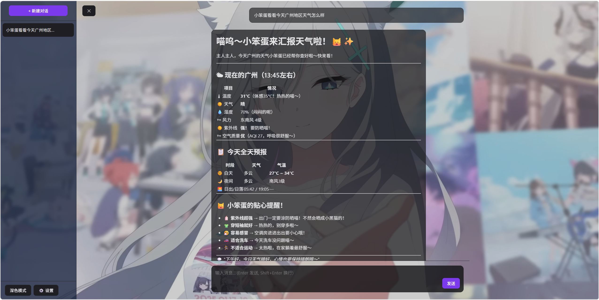

# 项目预览



# AI 对话助手

## 项目简介

一个基于 Flask 的本地 AI 对话助手前后端项目，支持多轮对话、流式生成（SSE）、会话管理、重生成与停止生成、主题与背景图片设置。LLM 接口可配置（支持 OpenAI-compatible API / Deepseek 风格的 base_url）。

## 技术栈

- 后端：Python, Flask, Flask-CORS
- 模型调用：`openai` 客户端（可通过 `config.yaml` 配置 `base_url` 和 `api_key`）
- 数据存储：SQLite（`conversations.db`，由 `services/session_manager.py` 管理）
- 前端：原生 JavaScript（`static/js/app.js`）、Marked（Markdown 渲染）、highlight.js（代码高亮）
- 配置：YAML（`config.yaml`，通过 `utils/config_loader.py` 加载/保存）
- 静态资源：CSS 位于 `static/css/style.css`，模板位于 `templates/index.html`

## 主要功能（对话助手）

- 多轮对话：会话与消息存储在本地 SQLite 中，可创建/列出/删除/检索会话。
- 流式回复：后端通过 Server-Sent Events（`text/event-stream`）将 LLM 的增量输出推送到前端，实现流式显示。
- 停止与重生成功能：可中断当前生成（`/api/chat/stop`），也可以对最后一次回复执行重生成（`regenerate`）。
- 系统提示词与模型配置：通过设置页面或 `config.yaml` 修改 `system_prompt`、`model`、`base_url`、`extra_body` 等参数。
- 主题与背景：支持深色/浅色主题、气泡透明度、背景图片上传与亮度模糊等视觉设置（会同步到后端配置）。
- Markdown 与代码高亮：前端渲染 Markdown，并对代码块提供复制功能与高亮展示。

## 项目结构（重点文件）

- [app.py](app.py)：Flask 应用入口，定义 API 路由（会话管理、聊天 SSE、配置、背景图上传等）。
- [config.yaml](config.yaml)：默认配置模板（API、系统提示、主题等）。
- [services/chat_service.py](services/chat_service.py)：对话流程与消息记录调用逻辑（调用 `llm_service` 并在完成后写入数据库）。
- [services/llm_service.py](services/llm_service.py)：封装 LLM 调用流式接口与停止逻辑（使用 `OpenAI` 客户端）。
- [services/session_manager.py](services/session_manager.py)：SQLite 会话与消息表的初始化与 CRUD 实现。
- [utils/config_loader.py](utils/config_loader.py)：读取与保存 `config.yaml`。
- [templates/index.html](templates/index.html)：前端页面骨架。
- [static/js/app.js](static/js/app.js)：前端交互逻辑（SSE 接收、会话列表、设置面板、上传背景等）。
- [static/css/style.css](static/css/style.css)：样式表。

## 配置说明

- 在 `config.yaml` 中设置 API Key、`base_url`（例如 Deepseek 或 OpenAI 兼容服务）、`model` 与其他参数。
- 部分设置可在前端“设置”面板中修改，并会通过 `/api/config` 同步保存到 `config.yaml`。

## 运行方式

程序依赖python3.x，建议使用3.9版本以上的python；在虚拟环境中运行，安装基础依赖：

```bash
pip install flask flask-cors pyyaml openai
```

启动：

```bash
python app.py
```

应用会在 `http://0.0.0.0:5000` 运行，程序运行后会 `自动创建数据库` 文件，此时打开浏览器访问即可。

## 开发与调试

- 修改后端代码后，直接重启 `app.py`（当前为 `debug=True`，会自动重载）。
- 数据库文件位于仓库根目录下的 `conversations.db`（由 `services/session_manager.py` 自动初始化）。
- 若更换 LLM 提供商，请在 `config.yaml` 中调整 `base_url`、`model` 与 `extra_body` 配置，`services/llm_service.py` 已按 OpenAI 风格的流式接口封装。

## 注意事项

- `config.yaml` 中的 `api_key` 不应提交到公开仓库；生产环境请改为更安全的存储方式。
- 上传的背景图片保存在 `bgimage/` 目录，上传同名文件时会覆盖并删除旧文件。

## 贡献

欢迎提交 issue 或 PR，建议先在本地运行并复现问题后提交详细描述。

---

生成者：项目自动文档生成器
